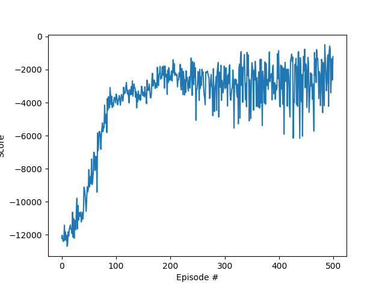

# Nonogram_DQN_Solver

This repository is a private approach to training a DQN agent to solve nonogram puzzles.  
(see https://en.wikipedia.org/wiki/Nonogram) 

While the environment itself was created, the DQN and agent rely heavily on this repository:  
https://github.com/sourcecode369/deep-reinforcement-learning/tree/master/DQN/LunarLander-v0  
Thanks a lot!

## Environment
State type:  Discrete(64)  
Number of actions:  50  
More information will follow soon.

## Current results
With the given code, 3 training runs with 500 epochs each were performed.  
The results are quite promising, but not yet final.

For evaluation, the trained agents were each given a random puzzle.  
They have 100 steps to solve this puzzle.  
In the current setup, a state is reached after 10-15 steps in which the agent is stuck / only performs one action in a continuous loop. (@FutureWork)  

As can be seen in the following three images, mistakes are also still made that may prevent the goal.

During the training the following values are achieved:

### Agent1

Episode 100	Average Score: -8958.15  
Episode 200	Average Score: -2564.90  
Episode 300	Average Score: -2467.80  
Episode 400	Average Score: -2642.08  
Episode 500	Average Score: -2180.86  

### Agent2

Episode 100	Average Score: -8642.55  
Episode 200	Average Score: -2401.74  
Episode 300	Average Score: -2151.25  
Episode 400	Average Score: -1892.52  
Episode 500	Average Score: -1214.48  

### Agent3

Episode 100	Average Score: -8527.56  
Episode 200	Average Score: -3132.81  
Episode 300	Average Score: -2688.90  
Episode 400	Average Score: -2788.20  
Episode 500	Average Score: -2608.07  

